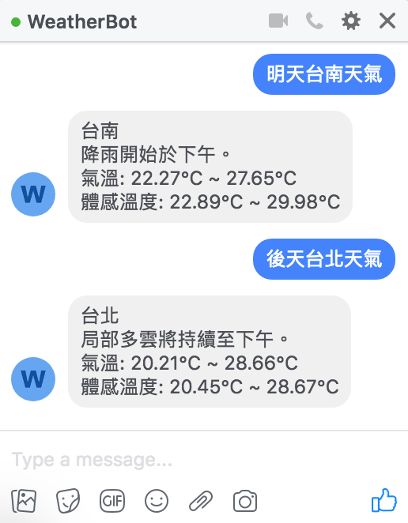

# WeatherBot
Demo
----

Setup:
------
1. Create a Facebook Page and [App](https://developers.facebook.com/)
    1. Generate Page Access Token 
    2. Set up Webhook
2. Set up [Dialogflow](https://dialogflow.com/)
    1. Create an agent
    2. Import the intents (intent_pkg.zip)
    3. Set up Webhook
3. Add key for [Google Geocoding API](https://developers.google.com/maps/documentation/geocoding/intro) and [Dark Sky API](https://darksky.net/dev)
4. $ FLASK_APP=main.py flask run
5. $ [ngrok](https://ngrok.com/) http 5000 (for TEST only)
